# DrawFlow Production Foundation and Proposal Flow PRD

**Product:** DrawFlow  
**Module:** Production foundation, canonical proposal package, admin approval, and loan closing  
**Status:** Draft for implementation scoping  
**Created:** May 27, 2026  
**Primary audience:** Product, engineering, implementation agents  
**Related documents:** `docs/vocabulary.md`, `docs/draw_flow_prd.md`, `docs/draw_flow_production_prd.md`, `docs/auth-rbac-foundation.md`, `docs/uiManifest/routeManifest.md`, `docs/drawflow-demo/timeline-setup-flow.md`, `docs/lender-portal-prototype-promotion.md`, `docs/specs/lender-portal-draw-review.md`, `src/components/prototypes/README.md`

---

## 1. Purpose

This PRD scopes the first productionization slice for DrawFlow. The goal is to land the production foundation required to move the proposal experience from demo routes into canonical authenticated routes without modifying existing demo tables or breaking unauthenticated demo access.

This slice includes:

- production Convex schema for the proposal-to-approved-loan-to-closed-build path,
- WorkOS-backed RBAC and resource ownership enforcement,
- canonical builder and backoffice routes,
- the full builder proposal package flow,
- backoffice proposal review,
- proposal approval and offline loan closing into an active build.

This slice does not attempt to productionize every demo surface. It creates the durable spine needed to port the high-value frontend work safely.

---

## 2. Non-Negotiable Decisions

1. Existing demo routes remain available to unauthenticated users.
2. Existing `demo_*` Convex tables are not mutated, migrated, or reused as production tables.
3. Production state uses new non-demo domain tables.
4. WorkOS remains the source of truth for users, organization membership, and organization role assignment.
5. `brokerages` is a DrawFlow domain extension of a WorkOS organization projection, not a competing membership model.
6. Authorization is enforced at every layer:
   - TanStack route `beforeLoad`,
   - typed frontend query/mutation wrappers,
   - fluent-convex middleware chains,
   - resource ownership checks inside reusable middleware before handler logic.
7. Roles and permissions are both required:
   - WorkOS roles define default persona and route eligibility.
   - Permissions and resource relationships decide specific actions.
8. Proposal approval does not create an active build.
9. Approved proposals remain approved until an offline loan closing is recorded.
10. Recording closing on an approved proposal moves it to `closed` and creates the active build.
11. Closing requires a build start date.
12. A build can be active with a future start date.
13. Prototype UI must not be reimplemented from scratch by inspection. Production routes and nested components must either extract, decouple, and refactor original demo components for reuse or copy the original route/component code and then iterate on the copy, while leaving the demo implementation unchanged for posterity.
14. Workflow rules must be defined from a single centralized location. A GUI can come later, but rules must not be scattered across route handlers, Convex functions, and frontend conditionals.
15. Back Office Review Requirements Setup directly promotes approved and locked
    Variant A. It remains inside the existing proposal Closing workspace and
    must not become a standalone policy route or parallel policy system.
16. The Review Requirements policy shown in the pre-closing summary is locked
    when closing is recorded and governs the active Build.

---

## 3. Scope

### 3.1 In Scope

- Production domain schema and indexes for:
  - brokerage domain extensions,
  - builder profiles and builder account links,
  - contractor profiles and optional contractor account groundwork,
  - milestone archetypes, templates, saved submilestones, and site visit guidance,
  - draw schedule scenarios,
  - build proposals,
  - proposal documents, including build permit PDFs,
  - proposal milestones and submilestones,
  - proposal draw schedule rows,
  - materialized proposal kanban read model,
  - active builds created when offline loan closing is recorded,
  - build broker assignments,
  - loan facility,
  - build capital plan,
  - build milestones and submilestones,
  - capital events and derived cash position projections,
  - audit events.
- Fluent-convex production auth middleware.
- Canonical route guards.
- Builder proposal package route.
- Backoffice proposal queue and review detail.
- Backoffice proposal kanban, review, approval, and closing workflow.
- Visual parity preservation for P0 screens defined in this PRD.
- Development seed data for production tables.
- Tests for schema behavior, RBAC, route guards, proposal submission, approval, and closing.
- Centralized workflow rule configuration used by approval and validation logic.

### 3.2 Out of Scope

- Mutating, migrating, or deleting demo tables.
- Replacing all demo routes.
- Full live build workspace productionization after closing is recorded.
- Full draw request/release production workflow.
- Full site visit mobile workflow productionization.
- Contractor login workspace.
- Contractor analytics, smart selection, or recommendation ranking.
- Cross-brokerage builder transfer workflow.
- Production external webhooks beyond audit/outbox foundation.
- GUI for configuring workflow rules.

---

## 4. Tenancy And WorkOS Boundary

### 4.1 WorkOS Source Of Truth

WorkOS owns:

- user identity,
- organization identity,
- organization membership,
- role assignment inside a WorkOS organization.

A broker belongs to a brokerage when their WorkOS organization membership for that brokerage has the `broker` role. A principal broker belongs when their membership has the `principle-broker` role. Backoffice staff, builders, builder staff, and contractors follow the same WorkOS membership model where authenticated membership exists.

### 4.2 Brokerage Domain Extension

The production `brokerages` table stores DrawFlow-specific fields for a WorkOS organization:

- `workosOrganizationId`,
- `legalName`,
- `displayName`,
- `status`,
- configuration references and metadata.

`brokerages` must be one-to-one with `workosOrganizations`. It must not become a parallel membership table.

### 4.3 Principal Broker Invariant

The one-active-principal-broker rule is application-layer enforcement while managing WorkOS role assignments. WorkOS remains the role source, but DrawFlow must prevent application workflows from creating two active principal brokers for the same brokerage.

---

## 5. Authorization Model

### 5.1 Enforcement Rings

Every production route and backend function must fail closed.

Frontend route guard:

- implemented in TanStack `beforeLoad`,
- requires authenticated session,
- requires active WorkOS organization where applicable,
- checks route-level role eligibility,
- redirects unauthorized users to the existing protected access flow.

Frontend query/mutation wrapper:

- requires explicit organization and resource scope inputs,
- centralizes loading, disabled, and authorization error states,
- never substitutes for backend enforcement.

Convex fluent middleware:

- is the authoritative enforcement layer,
- validates identity, active organization, WorkOS membership, role, permission, resource ownership, workflow state, and audit requirements.

### 5.2 Required Fluent Middleware Chains

Production functions should be composed from reusable chains, not one-off handler checks.

Required middleware concepts:

- `requireIdentity`
  - validates WorkOS-authenticated identity.
- `requireActiveOrganization`
  - validates the caller selected or supplied an active WorkOS organization.
- `requireWorkosMembership`
  - validates active membership in the WorkOS organization backing the brokerage.
- `requireRole`
  - checks normalized WorkOS role slugs.
- `requirePermission`
  - checks action permission after role defaults and overrides.
- `requireBrokerage`
  - resolves the brokerage row for the WorkOS organization projection.
- `requireBuildScope`
  - verifies build belongs to brokerage and caller has build access.
- `requireProposalScope`
  - verifies proposal belongs to brokerage and caller has proposal access.
- `requireAssignedBrokerOrPrincipal`
  - allows the assigned broker, principal broker, or platform admin.
- `requireBuilderOwnership`
  - allows builder users linked to the builder profile that owns the proposal/build.
- `requireWorkflowState`
  - prevents illegal state transitions.
- `requireAuditReason`
  - requires reason/comment metadata for material overrides, rejections, reassignment, and approval decisions where applicable.

### 5.3 Role And Permission Defaults

Roles remain WorkOS role slugs:

- `admin`,
- `principle-broker`,
- `broker`,
- `broker-staff`,
- `builder`,
- `builder-staff`,
- `contractor`,
- `member`.

Minimum permission slugs for this slice:

- `proposals:read`,
- `proposals:create`,
- `proposals:update:draft`,
- `proposals:submit`,
- `proposals:review`,
- `proposals:approve`,
- `proposals:reject`,
- `builds:create-from-proposal`,
- `builds:read`,
- `builds:assign-broker`,
- `settings:read`,
- `settings:manage`,
- `documents:upload`,
- `documents:read`,
- `audit:read`.

Default grants:

- `admin`: all permissions.
- `principle-broker`: all brokerage-scoped permissions.
- `broker`: assigned portfolio proposal/build read, create, update, submit-on-behalf if later enabled, and assigned build read.
- `broker-staff`: queue/read/review support only unless granted.
- `builder`: own proposal create/update/submit and own document upload/read.
- `builder-staff`: own builder profile access where linked.
- `contractor`: no proposal permissions in this slice.
- `member`: no production workspace access.

---

## 6. Production Domain Schema

The exact Convex validators can evolve during implementation, but the table boundaries below define the required persisted facts.

The schema below is a suggested target model from planning. It is not a mandate to force exact table names, field names, or normalization if implementation realities point elsewhere. Existing codebase patterns, Convex constraints, query performance, generated API ergonomics, and fluent-convex wrapper composition take precedence. If implementation needs to split, merge, rename, or denormalize a table, it should preserve the same domain facts, authorization boundaries, and auditability.

### 6.1 Identity And Brokerage Tables

Use existing WorkOS projection tables:

- `users`,
- `workosOrganizations`,
- `workosOrganizationMemberships`,
- `workosRoles`,
- `workosOrganizationRoles`,
- `workosPermissions`,
- `workosWebhookReceipts`.

Add production tables:

- `brokerages`
  - one-to-one domain extension of `workosOrganizations`,
  - includes `workosOrganizationId`, `legalName`, `displayName`, `status`, timestamps.
- `permissionOverrides`
  - optional app-level exceptions by WorkOS membership id,
  - includes `workosMembershipId`, `permissionSlug`, `effect`, `reason`, `expiresAt`, timestamps.
- `workflowRules`
  - centralized workflow rule configuration, not membership; see `docs/vocabulary.md` for the distinction between roles, permissions, and workflow rules,
  - includes site visit requirement config, approval requirements, draw release thresholds, override requirements.
- `workflowRuleSnapshots`
  - frozen copy of workflow rules when historical reproducibility is required.

Workflow rule snapshot guidance for this slice:

- Proposal submission creates the workflow rule snapshot for that proposal.
- Proposal approval and closing are governed by the submitted proposal's workflow rule snapshot.
- The active build created at closing links back to the same workflow rule snapshot that governed the submitted proposal unless implementation identifies a concrete reason to split review and build-activation snapshots.
- Draft proposal creation does not snapshot workflow rules unless the UI displays approval conditions that must remain frozen.
- The source workflow rules must be loaded from one production rules module/table boundary. Handlers should not embed ad hoc approval, site-visit, permit-waiver, or draw-release rules.

### 6.2 Builder Tables

- `builderProfiles`
  - brokerage-scoped builder/borrower entity,
  - includes `brokerageId`, `companyName`, `status`, contact fields, timestamps.
- `builderAccountLinks`
  - links authenticated users to builder profiles,
  - includes `builderId`, `userId`, `relationshipRole`, `status`, verification metadata.

Builder profiles can exist before every builder-side user has accepted an invite.

### 6.3 Contractor Tables

This slice lays groundwork only.

- `contractorProfiles`
  - canonical contractor domain profile,
  - can exist without an authenticated user account.
- `contractorRelationships`
  - brokerage-scoped relationship to a contractor profile.
- `contractorTrades`
  - trade labels/slugs for contractor profile.
- `contractorCapabilities`
  - maps contractor capability to milestone archetypes.
- `contractorAccountLinks`
  - optional future authenticated user link.

Contractor accounts are not required for this slice. The schema must support contractor profiles with no linked user.

### 6.4 Settings And Template Tables

Backoffice settings must persist construction roadmap configuration independently of any single proposal.

- `milestoneArchetypes`
  - brokerage-scoped archetypes for system milestone types,
  - examples: foundation, framing, rough-in, drywall, finishes.
- `milestoneArchetypeGuidanceItems`
  - site visit guidance attached to archetypes,
  - includes `kind`, `text`, `order`.
- `milestoneTemplates`
  - named proposal/build templates.
- `milestoneTemplateItems`
  - template rows referencing milestone archetypes.
- `submilestoneTemplateItems`
  - saved submilestones under template milestones.
- `drawScheduleScenarios`
  - named draw timing scenario for a template.
- `drawScheduleItems`
  - scenario rows with `drawKey`, `label`, `amountBps`, `timingDay`, `order`.
- `settingsEvents`
  - audit log for settings changes.

Site visit guidance is authored against milestone archetypes. When a site visit later targets milestones, the visit should snapshot guidance from each target milestone's archetype so the field package remains stable if backoffice settings change later.

### 6.5 Proposal Tables

- `buildProposals`
  - tenant-scoped proposal package,
  - includes `brokerageId`, `builderId`, `assignedBrokerUserId`, `templateId`, `selectedDrawScenarioId`, `buildPermitDocumentId`, optional `permitWaiverId`, `totalBudgetCents`, `borrowerCoPayBps`, `status`, timestamps.
- `proposalMilestones`
  - proposed roadmap rows,
  - includes `proposalId`, `archetypeId`, `milestoneKey`, `name`, `budgetCents`, `drawAvailabilityCents`, `dayStart`, `dayEnd`, `order`.
- `proposalSubmilestones`
  - proposed submilestone rows.
- `proposalDrawScheduleItems`
  - planned draw schedule rows copied from selected scenario and editable as proposal data,
  - remains mutable by backoffice after submission because the schedule is an execution plan, not a fixed obligation.
- `proposalKanbanCards`
  - materialized backoffice proposal kanban read model,
  - includes `brokerageId`, `proposalId`, `column`, assigned broker, builder display fields, total budget, Loan Percentage, permit status, warning count, and sort timestamps.
  - Columns for this slice: `draft`, `submitted`, `approved`, `closed`.
  - Cards are progressed by submit, review, approval, and closing actions, not drag-and-drop.
- `documentFiles`
  - proposal and later build documents,
  - includes permit PDFs,
  - stores Convex storage id, mime type, size, kind, uploader, and owning proposal/build references.
- `documentWaivers`
  - audited waiver records for expected documents, including permit PDF waivers,
  - includes `brokerageId`, `proposalId`, optional `buildId`, `documentKind`, `waivedByUserId`, `reason`, timestamps.
- `proposalEvents`
  - proposal-specific event log for create/update/submit/review/approve/reject/request changes.

The build permit PDF is expected in the proposal package. Approval may proceed without the PDF only when a principal broker or admin records an audited permit waiver with a reason.

### 6.6 Active Build Tables

Closing an approved proposal creates active build rows:

- `builds`
  - includes `brokerageId`, `builderId`, `approvedProposalId`, optional `buildPermitDocumentId`, optional `permitWaiverId`, `currentBrokerUserId`, `startDate`, `status`, `address`.
- `buildBrokerAssignments`
  - broker assignment history,
  - includes `buildId`, `brokerUserId`, `workosMembershipId`, `status`, `startsAt`, `endsAt`.
- `loanFacilities`
  - lender-approved loan terms,
  - includes `principalLimitCents`, `interestAnnualBps`, status.
- `buildCapitalPlans`
  - includes `totalBudgetCents`, `startingCashCents`, `borrowerCoPayBps`.
- `milestones`
  - active build milestone rows copied from approved proposal,
  - includes archetype, schedule offsets, budget, draw availability, and persisted facts required for state derivation.
- `submilestones`
  - active build checklist rows.
- `plannedDrawScheduleItems`
  - active build copy of the approved proposal draw schedule,
  - remains mutable as the build changes in the field.
- `buildCapitalEvents`
  - capital spikes, borrower cash infusions, and other dated cash-impacting events used to derive cash position projections.
- `auditEvents`
  - immutable material event trail.
- `eventOutbox`
  - integration dispatch foundation.

### 6.7 Loan Percentage And Draw Availability

Loan Percentage is the lender-funded percentage of each completed milestone budget.

The product accepts and displays Loan Percentage. The legacy `borrowerCoPayBps` field stores the complementary borrower contribution percentage for compatibility.

Example:

- Total budget: `$1,000,000`
- Approved lender principal: `$800,000`
- Loan Percentage: `80%`, represented internally by `borrowerCoPayBps: 2000`
- A milestone budgeted at `$100,000` unlocks `$80,000` in draw availability.

Formula:

```ts
drawAvailabilityCents = round(
  milestoneBudgetCents * (10000 - borrowerCoPayBps) / 10000
);
```

`loanFacilities.principalLimitCents` stores the lender-approved principal. `buildCapitalPlans.totalBudgetCents` and the complementary `borrowerCoPayBps` value define borrower contribution and per-milestone unlock math. Do not add a separate global `reimbursementBudgetCents` unless implementation proves a cached read model is required.

Derived cash position is not a separate source-of-truth table in this slice. It should be calculated from `buildCapitalPlans.startingCashCents`, borrower cash infusion events, capital spike/cost events, draw reimbursements, and planned/actual draw timing. Add a materialized read model later only if chart/query performance requires it.

### 6.8 Draw Schedule Mutability

The draw schedule is a planning suggestion and execution forecast, not a rigid calendar or milestone billing contract.

Builders may:

- request less than a planned draw amount,
- move a planned draw date,
- skip a planned draw,
- request a later draw that consumes accumulated availability.

Backoffice may edit proposal draw schedule rows after submission and active build planned draw rows after approval. These edits do not automatically require a request-changes cycle back to the builder.

The hard constraint is draw availability:

```ts
availableToDrawCents =
  sum(approvedMilestoneDrawAvailabilityUnlocksCents) -
  sum(priorNonDraftNonRejectedDrawRequestsCents);
```

A draw request cannot exceed current availability unless a future centrally configured workflow rule explicitly introduces an exception path. Draw requests and draws are build-level reimbursement records; they are not linked to a required source milestone.

The shared role-aware review and decision surface is governed by
`docs/specs/lender-portal-draw-review.md`. This proposal PRD owns availability
unlocking and planning rules; it does not authorize a separate Draw review UI.

### 6.9 Suggested Relationship Model

This UML reflects the planning model. Treat it as a schema sketch for implementation discussion, not as a required one-to-one translation into Convex tables.

```mermaid
classDiagram
  direction TB

  class User {
    Id id
    string authId
    string workosUserId
    string email
    string status
  }
  class WorkOSOrganization {
    Id id
    string workosOrganizationId
    string name
    string status
  }
  class WorkOSMembership {
    Id id
    string workosMembershipId
    string workosOrganizationId
    string workosUserId
    string roleSlug
    string status
  }
  class Brokerage {
    Id id
    string workosOrganizationId
    string legalName
    string displayName
    string status
  }
  class PermissionOverride {
    Id id
    string workosMembershipId
    string permissionSlug
    string effect
    string reason
  }
  class WorkflowRule {
    Id id
    Id brokerageId
    string ruleKey
    string ruleType
    string status
    any config
  }
  class WorkflowRuleSnapshot {
    Id id
    Id brokerageId
    string sourceRuleKey
    any frozenRule
    number createdAt
  }

  class MilestoneArchetype {
    Id id
    Id brokerageId
    string archetypeKey
    string systemType
    string name
    string status
  }
  class MilestoneArchetypeGuidanceItem {
    Id id
    Id archetypeId
    string kind
    string text
    number order
  }
  class MilestoneTemplate {
    Id id
    Id brokerageId
    string templateKey
    string title
    boolean isDefault
    string status
  }
  class MilestoneTemplateItem {
    Id id
    Id templateId
    Id archetypeId
    string milestoneKey
    string name
    number percentageBps
    number durationDays
    number order
  }
  class SubmilestoneTemplateItem {
    Id id
    Id templateMilestoneId
    string submilestoneKey
    string name
    number percentageBps
    number durationDays
    number order
  }
  class DrawScheduleScenario {
    Id id
    Id brokerageId
    Id templateId
    string scenarioKey
    string name
    boolean isActive
  }
  class DrawScheduleItem {
    Id id
    Id scenarioId
    string drawKey
    string label
    number amountBps
    number timingDay
    number order
  }

  class BuilderProfile {
    Id id
    Id brokerageId
    string companyName
    string status
  }
  class BuilderAccount {
    Id id
    Id builderId
    Id userId
    string relationshipRole
    string status
  }
  class ContractorProfile {
    Id id
    string canonicalName
    string kind
    string status
  }
  class ContractorRelationship {
    Id id
    Id brokerageId
    Id contractorId
    string status
    string visibility
  }
  class ContractorTrade {
    Id id
    Id contractorId
    string tradeSlug
    string label
    string status
  }
  class ContractorCapability {
    Id id
    Id contractorId
    Id milestoneArchetypeId
    string capabilitySlug
    string proficiency
  }
  class ContractorAccount {
    Id id
    Id contractorId
    Id userId
    string status
  }

  class BuildProposal {
    Id id
    Id brokerageId
    Id builderId
    Id assignedBrokerUserId
    Id templateId
    Id selectedDrawScenarioId
    Id workflowRuleSnapshotId
    Id buildPermitDocumentId
    Id permitWaiverId
    number totalBudgetCents
    number borrowerCoPayBps
    string status
    number submittedAt
  }
  class ProposalMilestone {
    Id id
    Id proposalId
    Id archetypeId
    string milestoneKey
    string name
    number budgetCents
    number drawAvailabilityCents
    number dayStart
    number dayEnd
    number order
  }
  class ProposalSubmilestone {
    Id id
    Id proposalMilestoneId
    string name
    number budgetCents
    number durationDays
    number order
  }
  class ProposalDrawScheduleItem {
    Id id
    Id proposalId
    string drawKey
    string label
    number amountCents
    number timingDay
    number order
  }
  class ProposalKanbanCard {
    Id id
    Id brokerageId
    Id proposalId
    string column
    Id assignedBrokerUserId
    string builderDisplayName
    number totalBudgetCents
    number borrowerCoPayBps
    string permitStatus
    number warningCount
    number sortAt
  }
  class DocumentFile {
    Id id
    Id brokerageId
    Id buildProposalId
    Id buildId
    string kind
    string storageId
    string mimeType
    number sizeBytes
  }
  class DocumentWaiver {
    Id id
    Id brokerageId
    Id proposalId
    Id buildId
    string documentKind
    Id waivedByUserId
    string reason
    number waivedAt
  }

  class Build {
    Id id
    Id brokerageId
    Id builderId
    Id approvedProposalId
    Id workflowRuleSnapshotId
    Id buildPermitDocumentId
    Id permitWaiverId
    Id currentBrokerUserId
    number startDate
    string status
    string address
  }
  class BuildBrokerAssignment {
    Id id
    Id buildId
    Id brokerUserId
    string workosMembershipId
    string status
    number startsAt
    number endsAt
  }
  class LoanFacility {
    Id id
    Id buildId
    number principalLimitCents
    number interestAnnualBps
    string status
  }
  class BuildCapitalPlan {
    Id id
    Id buildId
    number totalBudgetCents
    number startingCashCents
    number borrowerCoPayBps
  }
  class Milestone {
    Id id
    Id buildId
    Id archetypeId
    string milestoneKey
    string name
    number budgetCents
    number drawAvailabilityCents
    string status
    number dayStart
    number dayEnd
    number order
  }
  class Submilestone {
    Id id
    Id milestoneId
    string name
    string status
    number budgetCents
    number durationDays
    number order
  }
  class MilestoneCompletionSubmission {
    Id id
    Id milestoneId
    Id submittedByUserId
    number completedDay
    number actualCostCents
    string note
    number submittedAt
  }
  class MilestoneCompletionReview {
    Id id
    Id milestoneId
    string status
    number completedDay
    number actualCostCents
    Id reviewedByUserId
  }
  class DrawAvailabilityUnlock {
    Id id
    Id buildId
    Id milestoneId
    Id completionReviewId
    number amountCents
    string status
  }
  class DrawRequest {
    Id id
    Id buildId
    Id plannedDrawId
    string drawKey
    string status
    number requestedCents
    number requestedDay
    Id requestedByUserId
  }
  class BuildCapitalEvent {
    Id id
    Id buildId
    string eventKey
    string kind
    number amountCents
    number eventDay
    string label
  }
  class BuildContractorAssignment {
    Id id
    Id buildId
    Id contractorRelationshipId
    string role
    string status
  }
  class MilestoneContractorAssignment {
    Id id
    Id buildId
    Id milestoneId
    Id contractorRelationshipId
    string role
    number allocatedBudgetCents
    string status
  }

  class SiteVisit {
    Id id
    Id brokerageId
    Id buildId
    string status
    Id assignedUserId
    string requestReason
  }
  class SiteVisitTarget {
    Id id
    Id siteVisitId
    Id milestoneId
    string milestoneKey
    number milestoneOrder
  }
  class SiteVisitToken {
    Id id
    Id siteVisitId
    string tokenHash
    number expiresAt
    number consumedAt
    string status
  }
  class SiteVisitGuidanceItem {
    Id id
    Id siteVisitTargetId
    Id sourceGuidanceItemId
    string kind
    string text
    number order
  }
  class SiteVisitReport {
    Id id
    Id siteVisitId
    string verdict
    string notes
    number completedAt
  }
  class AuditEvent {
    Id id
    Id brokerageId
    Id actorUserId
    string entityType
    string entityId
    string eventType
  }

  WorkOSOrganization "1" --> "1" Brokerage : mapsTo
  WorkOSOrganization "1" --> "*" WorkOSMembership : sourceMemberships
  User "1" --> "*" WorkOSMembership : orgRoles
  WorkOSMembership "1" --> "*" PermissionOverride : appExceptions
  Brokerage "1" --> "*" WorkflowRule : workflowRules
  WorkflowRule "1" --> "*" WorkflowRuleSnapshot : frozenInto

  Brokerage "1" --> "*" MilestoneArchetype : milestoneArchetypes
  MilestoneArchetype "1" --> "*" MilestoneArchetypeGuidanceItem : siteVisitGuidance
  Brokerage "1" --> "*" MilestoneTemplate : templates
  MilestoneTemplate "1" --> "*" MilestoneTemplateItem : milestoneRows
  MilestoneArchetype "1" --> "*" MilestoneTemplateItem : reusedByTemplates
  MilestoneTemplateItem "1" --> "*" SubmilestoneTemplateItem : savedSubmilestones
  MilestoneTemplate "1" --> "*" DrawScheduleScenario : drawScenarios
  DrawScheduleScenario "1" --> "*" DrawScheduleItem : scheduledDraws

  Brokerage "1" --> "*" BuilderProfile : builders
  BuilderProfile "1" --> "*" BuilderAccount : userAccounts
  User "1" --> "*" BuilderAccount : builderLogin
  ContractorProfile "1" --> "*" ContractorRelationship : brokerageBank
  Brokerage "1" --> "*" ContractorRelationship : contractorRelationships
  ContractorProfile "1" --> "*" ContractorTrade : trades
  ContractorProfile "1" --> "*" ContractorCapability : milestoneCapabilities
  MilestoneArchetype "1" --> "*" ContractorCapability : capabilityTarget
  ContractorProfile "1" --> "*" ContractorAccount : userAccounts
  User "1" --> "*" ContractorAccount : contractorLogin

  Brokerage "1" --> "*" BuildProposal : proposals
  BuilderProfile "1" --> "*" BuildProposal : proposedWork
  User "1" --> "*" BuildProposal : assignedBroker
  MilestoneTemplate "1" --> "*" BuildProposal : selectedTemplate
  DrawScheduleScenario "1" --> "*" BuildProposal : selectedScenario
  WorkflowRuleSnapshot "1" --> "*" BuildProposal : governsProposal
  BuildProposal "1" --> "0..*" DocumentFile : proposalDocuments
  BuildProposal "0..1" --> "0..1" DocumentFile : buildPermit
  BuildProposal "0..1" --> "0..1" DocumentWaiver : permitWaiver
  BuildProposal "1" --> "*" ProposalMilestone : plannedMilestones
  MilestoneArchetype "1" --> "*" ProposalMilestone : archetype
  ProposalMilestone "1" --> "*" ProposalSubmilestone : plannedSubmilestones
  BuildProposal "1" --> "*" ProposalDrawScheduleItem : plannedDrawSchedule
  BuildProposal "1" --> "1" ProposalKanbanCard : kanbanReadModel

  BuildProposal "0..1" --> "0..1" Build : activatedByClosing
  Brokerage "1" --> "*" Build : builds
  BuilderProfile "1" --> "*" Build : ownsBuild
  WorkflowRuleSnapshot "1" --> "*" Build : governsBuild
  Build "0..1" --> "0..1" DocumentFile : inheritedBuildPermit
  Build "0..1" --> "0..1" DocumentWaiver : inheritedPermitWaiver
  Build "1" --> "0..*" DocumentFile : buildDocuments
  Build "1" --> "*" BuildBrokerAssignment : brokerHistory
  User "1" --> "*" BuildBrokerAssignment : brokerAssignee
  Build "1" --> "1" LoanFacility : loanTerms
  Build "1" --> "1" BuildCapitalPlan : cashAndReimbursementPlan
  Build "1" --> "*" Milestone : milestones
  MilestoneArchetype "1" --> "*" Milestone : archetype
  Milestone "1" --> "*" Submilestone : checklist
  Milestone "1" --> "*" MilestoneCompletionSubmission : builderClaims
  Milestone "1" --> "*" MilestoneCompletionReview : completionReviews
  MilestoneCompletionSubmission "1" --> "0..1" MilestoneCompletionReview : reviewedBy
  MilestoneCompletionReview "1" --> "0..1" DrawAvailabilityUnlock : unlocksCapacity
  Build "1" --> "*" DrawRequest : reimbursementRequests
  ProposalDrawScheduleItem "1" --> "0..*" DrawRequest : scheduleBasis
  Build "1" --> "*" BuildCapitalEvent : cashInfusionsAndSpikes

  Build "1" --> "*" BuildContractorAssignment : projectContractors
  ContractorRelationship "1" --> "*" BuildContractorAssignment : supplies
  Milestone "1" --> "*" MilestoneContractorAssignment : milestoneAssignments
  ContractorRelationship "1" --> "*" MilestoneContractorAssignment : performsWork

  Build "1" --> "*" SiteVisit : inspections
  SiteVisit "1" --> "*" SiteVisitTarget : targetMilestones
  Milestone "1" --> "*" SiteVisitTarget : inspectedBy
  SiteVisit "1" --> "0..*" SiteVisitToken : tokenAccess
  SiteVisitTarget "1" --> "*" SiteVisitGuidanceItem : guidance
  MilestoneArchetypeGuidanceItem "1" --> "*" SiteVisitGuidanceItem : copiedFrom
  SiteVisit "1" --> "0..1" SiteVisitReport : report

  Brokerage "1" --> "*" AuditEvent : auditTrail
  User "1" --> "*" AuditEvent : actor
```



---

## 7. Proposal Kanban Read Model

The first implementation should materialize the proposal kanban read model because the demo and backoffice surface already contain a kanban-style proposal review workflow.

This PRD slice is limited to proposal kanban, not build milestone kanban.

Proposal kanban columns:

- `draft`
  - proposal exists but has not been submitted.
- `submitted`
  - builder submitted the proposal package for backoffice review.
- `approved`
  - backoffice approved the proposal package, but the deal has not closed and no active build exists yet.
- `closed`
  - offline loan closing has been recorded and the build is active.

Kanban behavior:

- No drag-and-drop card movement in this slice.
- Cards move columns only through explicit backoffice/builder workflow actions.
- Builder submit moves `draft` proposal data into the `submitted` kanban column.
- Backoffice approve moves `submitted` to `approved`.
- Backoffice records loan closing, which moves `approved` to `closed` and creates the active build.
- Request-changes and reject are audited review outcomes, not proposal states and not kanban columns.

The `proposalKanbanCards` table is a read model. Source of truth remains `buildProposals.status`, proposal events, audit events, and active build creation. Updates to the read model must happen in the same mutation that changes proposal lifecycle state.

Build milestone kanban is intentionally deferred from this implementation slice. The production schema should still preserve the facts needed for future milestone kanban derivation: build start date, milestone offsets, completion submissions, site visits, site visit reports, milestone reviews, and draw availability unlocks.

---

## 8. Canonical Routes

### 8.1 Demo Routes

Unauthenticated demo routes remain available:

- `/demo/*`,
- `/builder/demo/*`,
- existing demo timeline, drawflow, and site visit demo routes.

No production route guard should be added to demo routes.

### 8.2 Builder Routes

Required routes:

- `/builder`
  - authenticated builder workspace entry.
- `/builder/proposals`
  - list own draft/submitted/approved/closed proposals.
- `/builder/proposals/new`
  - creates or initializes a new proposal package.
- `/builder/proposals/$proposalId`
  - edits draft proposal package or displays submitted/review state.

Route guard:

- authenticated,
- active WorkOS organization,
- role `builder`, `builder-staff`, or `admin`,
- builder account link or admin override,
- proposal ownership for `$proposalId`.

### 8.3 Backoffice Routes

Required routes:

- `/backoffice`
  - authenticated backoffice entry.
- `/backoffice/proposals`
  - materialized proposal kanban with `draft`, `submitted`, `approved`, and `closed` lanes.
- `/backoffice/proposals/$proposalId`
  - proposal review, request changes, reject, approve, record closing.
- `/backoffice/builds/$buildId`
  - active build detail target after deal close.
- `/backoffice/settings`
  - production settings for milestone archetypes, templates, saved submilestones, guidance, and draw schedule scenarios.

Route guard:

- authenticated,
- active WorkOS organization,
- role `admin`, `principle-broker`, `broker`, or `broker-staff`,
- permission required by route,
- resource scope for proposal/build.

---

## 9. Builder Proposal Package Flow

The proposal package is one coherent workspace, not several unrelated routes.

Required sections:

1. Proposal identity
   - builder profile,
   - build name,
   - address/location,
   - assigned broker default from current brokerage relationship where applicable.
2. Documents
   - build permit PDF upload,
   - supporting documents.
3. Budget and capital
   - total budget,
   - approved/requested lender principal context,
   - starting cash on hand,
   - Loan Percentage.
4. Template selection
   - milestone template from production settings.
5. Milestone worksheet
   - milestone ordering,
   - milestone budgets,
   - durations,
   - included/excluded rows,
   - saved submilestones.
6. Draw schedule
   - selected draw schedule scenario,
   - editable proposal draw schedule rows,
   - draw timing and amount validation.
7. Review and submit
   - readiness checks,
   - warnings,
   - submit action.

Drafts must autosave or explicitly save without relying on demo tables.

### 9.1 Proposal Validation

Submission requires:

- valid builder profile,
- active brokerage,
- assigned broker or assignable broker candidate,
- build name,
- address,
- build permit PDF or missing-permit warning,
- total budget greater than zero,
- Loan Percentage between `0%` and `100%`, persisted as the complementary `borrowerCoPayBps` value between `0` and `10000`,
- at least one included milestone,
- included milestone percentages total `10000` bps where percentage allocation is used,
- every included milestone has name, budget, duration, and archetype,
- active draw schedule scenario,
- draw schedule rows total `10000` bps where percentage allocation is used,
- draw timing is valid against template/schedule rules,
- proposal belongs to the active brokerage and caller's builder profile.

### 9.2 Proposal States

Canonical proposal states for this slice:

- `draft`,
- `submitted`,
- `approved`,
- `closed`.

These are the actual proposal lifecycle states. Do not add a `close` state.

Only `draft` proposals are builder-editable. Submitted and approved proposals are locked for builder edits except for backoffice review actions and backoffice draw schedule edits.

Proposal kanban columns for this slice are exactly `draft`, `submitted`, `approved`, and `closed`.

Request-changes, reject, and archive behavior should be modeled as proposal events, review outcomes, or secondary flags rather than extra proposal lifecycle states unless implementation discovers a hard existing-code constraint.

---

## 10. Backoffice Review, Approval, And Closing

### 10.1 Review Queue

`/backoffice/proposals` shows the materialized proposal kanban cards visible to the caller:

- principal broker: all brokerage proposals,
- assigned broker: assigned proposals,
- broker staff: queue or assigned proposals where permission grants access,
- admin: all proposals.

Queue rows should show:

- proposal kanban column,
- builder,
- proposal title,
- assigned broker,
- total budget,
- Loan Percentage,
- requested principal,
- permit status,
- milestone count,
- submitted timestamp,
- warning count.

### 10.2 Review Detail

`/backoffice/proposals/$proposalId` must show:

- proposal identity,
- builder profile,
- broker assignment,
- build location/address,
- permit PDF and supporting documents,
- budget and capital inputs,
- milestone worksheet,
- submilestones,
- draw schedule,
- validation warnings,
- audit/event history,
- admin actions.

### 10.3 Admin Actions

Allowed review actions:

- request changes,
- reject,
- approve,
- record closing.

Request changes requires:

- reason/comment,
- proposal status returns to `draft`,
- builder can edit again from the draft state,
- audit event records actor, reason, and prior state.

Reject requires:

- reason/comment,
- reject is recorded as an audited review outcome, not a proposal lifecycle state,
- proposal remains visible for audit and can be hidden from default active kanban views by review outcome,
- no active build is created.

Approve requires:

- principal broker or admin permission by default,
- assigned broker may not final approve unless future workflow rules explicitly grant it,
- assigned broker confirmation or reassignment,
- approval comment where configured,
- build permit PDF exists or principal broker/admin audited permit waiver is recorded.

Approval side effects:

- proposal status becomes `approved`,
- create and link a `documentWaivers` record when approval proceeds without a permit PDF,
- record permit waiver audit event when approval proceeds without a permit PDF,
- move the proposal kanban card to `approved`,
- write audit event,
- write proposal event.

Approve does not create an active build.

Recording closing requires:

- proposal status is `approved`,
- principal broker or admin permission by default,
- required build start date,
- start date can be future,
- confirmation that the offline loan closing has occurred,
- assigned broker confirmation or reassignment.

Closing side effects:

- proposal status becomes `closed`,
- move the proposal kanban card to `closed`,
- create active `builds` row,
- copy/link original build permit document to `builds.buildPermitDocumentId` when present, or link the waiver to `builds.permitWaiverId` when waived,
- create `buildBrokerAssignments` active row,
- create `loanFacilities` row,
- create `buildCapitalPlans` row,
- create active build milestones and submilestones from proposal rows,
- create active planned draw schedule rows from proposal draw schedule,
- hand the locked Review Requirements policy to the active Build through the
  canonical policy and closing boundary,
- write audit event,
- write proposal event,
- navigate or link to `/backoffice/builds/$buildId`.

### 10.4 Review Requirements Setup And Policy Lock

Before Back Office records closing, the existing proposal Closing workspace
must include the approved Variant A Review Requirements Setup interaction.

The production contract is:

- Draw reviewer requirement: Back Office only, lender quorum only, or both.
- Milestone reviewer requirement: the same three alternatives, plus separate
  Site Visit required and receipt / invoice required controls.
- Back Office approval is one authorized approval.
- If both reviewer groups are required, Back Office and the lender quorum may
  complete in either order.
- Lender quorum is selectable from one through the count of active assigned
  lender members.
- The pre-closing summary clearly identifies the policy that will govern the
  active Build.
- Recording closing locks the policy. This PRD does not define post-closing
  editing.

Implementation must start from
`src/components/prototypes/BackOfficeReviewRequirementsSetupPrototype.tsx` and
Variant A at
`/backoffice/proposals/review-requirements-prototype?variant=A`. The prototype
is a read-only throwaway with representative membership data and local state;
those details are not a persistence contract. Replace them with canonical
membership, policy, audit, and closing integrations without changing the
selected structure.

Do not add a standalone policy system, deadlines or SLAs, generic comments, or
additional reviewer roles. The detailed locked contract is in the **Back Office
Review Requirements Setup** section of `src/components/prototypes/README.md`,
and its implementation gate is in
`docs/lender-portal-prototype-promotion.md`. Material divergence requires a new
product decision and aligned updates to all referenced documents before code
work.

---

## 11. Frontend Preservation Strategy

Do not introduce adapter bloat.

Do not rebuild the demo UI from scratch by looking at it and approximating the behavior. The prototype is the source artifact for UI/UX preservation.

Use this strategy:

1. Keep demo route code and demo tables intact.
2. Copy route/container surfaces into canonical routes when extraction would be risky or slow.
3. Replace demo query/mutation calls with direct production Convex functions.
4. Extract presentational components when their props are clean or can be made production-shaped through a scoped refactor.
5. Do not create compatibility adapters that translate production data into demo data assumptions.
6. Do not let demo lifecycle assumptions leak into production handlers.
7. Prefer extraction only when the component is already or can cleanly become presentational.
8. If extraction would require untangling business logic first, copy the route/component into the canonical production area and adapt the copy.
9. The original demo implementation remains unchanged and available as historical prototype/reference.
10. Follow this PRD's Visual Parity Manifest section for P0 parity screens, baseline screenshots, target production routes, and acceptance checks.
11. Do not self-roll replacement components, layouts, tables, charts, shells, cards, drawers, or interactions for any productionized demo surface.

The production implementation can preserve the UI/UX craft while rejecting prototype data assumptions.

---

## 12. Visual Parity Manifest

This manifest defines the demo screens whose UI/UX must be preserved when productionized into authenticated canonical routes.

No productionized demo surface may be rebuilt from scratch by visually inspecting the demo. Implementation must either extract, decouple, and refactor the original demo components or copy the original route/component code into the production route and iterate on that copy against production Convex functions.

### 12.1 Parity Rules

1. Demo routes remain public and unchanged.
2. Production routes must preserve layout, interaction model, information hierarchy, motion, density, and visual language unless product explicitly changes them.
3. Production data access must be rewritten directly against production tables/functions. Do not introduce demo-shape adapters as a compatibility layer.
4. Every parity screen needs baseline screenshots before implementation and comparison screenshots after productionization.
5. Desktop and mobile parity are both required where the demo has responsive behavior.
6. Visual parity does not mean preserving demo business assumptions. Incorrect assumptions must be corrected in data flow, labels, validation, and state transitions while preserving the screen craft.
7. No self-rolled replacement components, layouts, tables, cards, charts, shells, drawers, or interactions are allowed for productionizing listed demo surfaces.
8. Acceptable implementation paths are only:
   - copy the demo route/component and iterate on the copy, or
   - extract the demo component, decouple business logic, and refactor it into reusable production-ready pieces.
9. If a demo surface is made of nested components, the rule applies to the nested components too.

### 12.2 Capture Standard

For each screen:

- Capture desktop at `1440x1000`.
- Capture tablet at `1024x768` when the screen has dense tables, timelines, or dashboards.
- Capture mobile at `390x844`.
- Capture any important open states: drawers, popovers, expanded rows, selected milestone, validation warnings, submitted/read-only banners.
- Store captures under `reports/visual-parity/<screen-id>/`.
- Record the demo URL, production URL, seed data/persona, viewport, and timestamp in the PR or implementation notes.

### 12.3 P0 Screens

These are required for the first production proposal-flow port.

| ID | Screen | Demo URL | Demo source | Production target | Parity requirement |
|---|---|---|---|---|---|
| `VP-001` | Builder Dashboard | `/demo/drawflow/builder-dashboard` | `src/routes/demo/drawflow/builder-dashboard.tsx`, `src/features/builder-dashboard/BuilderTimelineDashboard.tsx` | `/builder` or `/builder/proposals` depending final route split | Preserve dashboard scaffold, status KPIs, live-build/proposal registry sections, table density, action placement, empty states, and builder shell affordances. |
| `VP-002` | Timeline Setup: Project Setup | `/demo/timeline` initial setup state | `src/routes/demo/timeline/index.tsx`, `src/routes/demo/timeline/-TimelineSetupFlow.tsx`, `src/routes/demo/timeline/-timeline-setup-flow.css` | `/builder/proposals/new` initial proposal package step | Preserve "DrawFlow timeline setup" header, "Reimbursement roadmap generator" title, saved indicator, four-step rail, Step 1 of 4 Project Setup layout, template cards, budget/cash/Loan Percentage/address/permit controls, sidecar summary, validation styling, and primary action hierarchy. |
| `VP-003` | Timeline Setup: Milestones & Budget | `/demo/timeline` after Project Setup continue action | `src/routes/demo/timeline/-TimelineSetupFlow.tsx`, `src/routes/demo/timeline/-TimelineMilestoneWorksheetTable.tsx`, `src/routes/demo/timeline/-timeline-setup-flow.css` | `/builder/proposals/new` milestone/budget step or embedded proposal route step | Preserve saved indicator, Step 2 of 4 Milestones & Budget, dark blueprint worksheet treatment, sortable milestone rows, generated milestone icons, budget/duration editing, active/excluded handling, expanded submilestone editor, side panel behavior, and generate-roadmap action. |
| `VP-004` | DrawFlow Roadmap Workspace | `/demo/timeline/$timelineId?proposal=$proposalId` | `src/routes/demo/timeline/$timelineId.tsx`, `src/routes/demo/timeline/index.tsx`, `src/components/roadmap/AnimatedCurvedTimeline.tsx`, `src/routes/demo/timeline/-MilestoneCard.tsx`, timeline chart/draw components under `src/routes/demo/timeline/` | `/builder/proposals/$proposalId/roadmap` or canonical proposal roadmap workspace route | Preserve curved roadmap canvas, milestone card treatment, timeline controls, draw markers, draw availability and cashflow charts, submitted/read-only behavior, share/proposal link affordances where applicable, milestone detail interactions, responsive framing, and visual grouping of proposed draw timing. |

### 12.4 Screen Notes

#### VP-001 Builder Dashboard

The production dashboard should reuse `BuilderTimelineDashboardSurface` or a direct copy-derived equivalent. Do not replace it with a generic dashboard layout.

Important states:

- no rows,
- draft proposals,
- submitted proposals,
- approved/closed live build rows after production state correction,
- action button to start a new proposal.

Production adjustment:

- Demo currently treats `approved` as live-build status. Production lifecycle is `draft -> submitted -> approved -> closed`; active build appears only after closing is recorded.

#### VP-002 Project Setup

This is the first production proposal intake screen with the highest risk of visual regression because it combines identity, financing assumptions, address, permit, template, and progress state.

Production adjustments:

- Loan Percentage remains percentage/bps, not cents. Persist its complement in the legacy `borrowerCoPayBps` field.
- Permit PDF is expected, but principal broker/admin approval can later proceed with audited waiver.
- Starting cash/cash infusions belong to build capital planning, not `loanFacilities`.

#### VP-003 Milestones & Budget

The milestone worksheet is a core prototype asset. Its blueprint table, row expansion, submilestone editing, and sortable behavior must be extracted/copied rather than rebuilt.

Source implementation:

- `src/routes/demo/timeline/-TimelineMilestoneWorksheetTable.tsx`
- `src/routes/demo/timeline/-TimelineSetupFlow.tsx`
- `src/routes/demo/timeline/-timeline-setup-flow.css`

The production milestone planning table must be an extraction/reuse or copy/adapt port of the existing worksheet implementation.

Production adjustments:

- Milestone rows should map to production proposal milestones and proposal submilestones.
- Milestone archetypes come from production backoffice settings.
- Contractor capabilities later map to milestone archetypes, but contractor assignment is not required for this screen's first parity pass.

#### VP-004 Roadmap Workspace

This is the primary roadmap artifact generated from the proposal setup. It must retain the spatial understanding created by the demo: milestone sequencing, draw timing, charts, and visual reimbursement constraints.

Production adjustments:

- Draw schedule rows are mutable suggestions.
- Draw requests are not linked to required milestones.
- Draw availability is unlocked by approved milestone completion later in active build execution.
- In proposal mode, the roadmap visualizes proposed timing and availability math, not actual approved draw availability.

### 12.5 Candidate P1 Screens

These are likely parity surfaces, but they are not yet required for the first proposal-flow PRD slice unless product adds them to P0.

| ID | Screen | Demo URL/source | Reason to track |
|---|---|---|---|
| `VP-101` | Backoffice Proposal Kanban | `/backoffice`, `src/routes/backoffice/index.tsx`, `src/features/backoffice-dashboard/*` | Production proposal kanban is in scope; visual parity may be needed after P0 builder flow is locked. |
| `VP-102` | Backoffice Proposal Review Detail | `/backoffice/proposals/$planId`, `src/routes/backoffice/proposals.$planId.tsx` | Review/approve/record-closing workflow is in scope and likely has existing interaction craft. |
| `VP-103` | Builder Proposal Registry | `/builder/demo/dashboard/proposals`, `src/routes/builder/demo/dashboard/proposals/*` | May overlap with VP-001 but could become a dedicated production route. |
| `VP-104` | Builder Live Build Detail | `/builder/demo/dashboard/builds/$buildId`, `src/routes/builder/demo/dashboard/builds/*` | Deferred until active build workspace productionization. |

### 12.6 Visual Parity Acceptance Criteria

1. Every P0 screen has a baseline demo screenshot set.
2. Every productionized P0 screen has a matching production screenshot set.
3. Implementation notes name whether each route/component used extraction/decoupling/refactor or copy/adapt.
4. Review confirms no P0 production screen or nested component was recreated from scratch by visual approximation.
5. Any intentional visual changes are listed with product rationale.
6. Demo routes still render without auth and without production schema dependencies.

---

## 13. Testing Requirements

### 13.1 Convex Tests

Required coverage:

- WorkOS role normalization remains intact.
- Auth middleware rejects unauthenticated callers.
- Route capability middleware rejects wrong roles.
- Brokerage lookup resolves from WorkOS organization projection.
- Broker access derives from WorkOS membership role.
- Principal broker can view all brokerage proposals.
- Broker can view assigned proposal/build.
- Broker cannot view unassigned proposal/build unless granted.
- Builder can create and edit own draft proposal.
- Builder cannot edit submitted proposal.
- Proposal submission validates required fields.
- Admin/principal broker can approve submitted proposal without creating an active build.
- Admin/principal broker can record closing for an approved proposal with start date.
- Recording closing creates active build and associated rows.
- Close preserves original build permit link or permit waiver link.
- Future start date is allowed.
- Rejected review outcome does not create build.
- Request changes returns the proposal to draft for builder edit.
- Contractor profile can exist without account link.
- Proposal kanban read model materializes draft, submitted, approved, and closed columns.

### 13.2 Frontend Tests

Required coverage:

- `/builder/demo/*` remains unauthenticated.
- `/demo/*` remains unauthenticated.
- `/builder/proposals/new` requires authenticated builder access.
- `/backoffice/proposals` requires backoffice access.
- Proposal package renders all required sections.
- Permit PDF upload state is visible.
- Loan Percentage input stores percentage/bps semantics.
- Admin review page displays proposal package context.
- Proposal kanban displays draft, submitted, approved, and closed lanes.
- Approve flow moves submitted proposal to approved without creating a build.
- Record-closing flow requires start date.
- Record-closing flow creates active build and links to build detail.

### 13.3 Verification Commands

Expected implementation verification:

```sh
bun x convex codegen
bun x tsc -p convex/tsconfig.json
bun run test
bun run build
```

---

## 14. Acceptance Criteria

This slice is complete when:

1. New production schema tables exist with required indexes and validators.
2. Existing demo routes and demo tables still work unchanged.
3. Production RBAC is enforced through fluent-convex middleware chains.
4. Canonical builder proposal routes are authenticated and role guarded.
5. Canonical backoffice proposal routes are authenticated and role guarded.
6. Builder can create, edit, save, and submit a production proposal package.
7. Proposal package persists permit PDF, budget, Loan Percentage as the complementary legacy bps value, starting cash, selected template, milestones, submilestones, and draw schedule rows.
8. Backoffice can review submitted proposal package.
9. Backoffice can edit proposal draw schedule rows after submission without forcing a request-changes cycle.
10. Principal broker or admin can approve a submitted proposal without creating an active build.
11. Principal broker or admin can approve without a permit PDF only by recording an audited waiver reason.
12. Proposal kanban read model materializes draft, submitted, approved, and closed columns.
13. Principal broker or admin can record closing for an approved proposal with a required start date.
14. Recording closing moves the proposal to `closed` and creates an active build even when the start date is in the future.
15. Active build links back to the original permit PDF when present, or to the audited permit waiver when waived.
16. Active build has assigned broker history.
17. Active build planned draw schedule remains mutable and draw requests are constrained by draw availability.
18. Contractor profiles can be created without authenticated contractor accounts.
19. P0 visual parity screens from this PRD's Visual Parity Manifest have baseline and production comparison screenshots.
20. P0 production routes/components are copy/adapt or extract/decouple/refactor ports of the demo implementation, with no self-rolled replacements.
21. Tests pass.

---

## 15. Open Implementation Questions

No open implementation questions remain from the planning decisions captured in this PRD revision.
