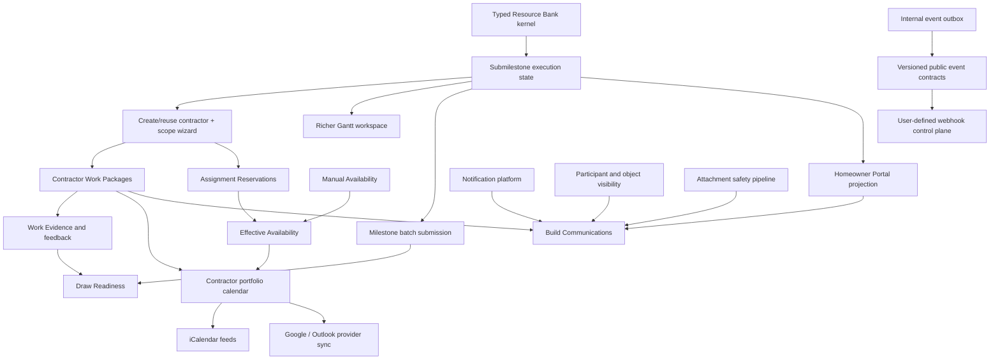

# DrawFlow Easy-Win Feature Priorities

**Product:** DrawFlow / FairLend construction draw management  
**Date:** 2026-07-16  
**Status:** Revised prioritized product backlog derived from competitive research, repository audit, and product-direction input  
**Source report:** [`drawflow_competitive_market_research.md`](./drawflow_competitive_market_research.md)  
**Related product sources:** [`draw_flow_prd.md`](../draw_flow_prd.md), [`contractor-workspace-prd.md`](../contractor-workspace-prd.md), [`vocabulary.md`](../vocabulary.md), and [`notification-system-prd.md`](../notification-system-prd.md)  

## 1. Prioritization Standard

This list deliberately favors features that:

1. improve draw velocity, evidence quality, stakeholder clarity, or operational throughput;
2. map to DrawFlow's existing Build, Milestone, Draw, Evidence, Site Visit, contractor, calendar, and audit models;
3. reuse implemented queries, mutations, routes, components, and tokenized sharing patterns;
4. can ship without first completing a nationwide service network, external certification, accounting OAuth, or a new legal rules engine;
5. preserve reimbursement-only funding, separation of staff recommendation from admin authority, evidence retention after geofence failure, organization scoping, and auditable decisions.

Relative effort:

- **S:** primarily a derived view or narrow workflow over existing production data.
- **M:** one new organization-scoped domain object or service plus a small number of surfaces.
- **L:** external API/commercial dependency, cross-system reconciliation, or substantial new infrastructure.

Only S and M features qualify as immediate easy wins. L items remain visible in the ranking because they are now explicit product priorities, but Section 7 separates them into strategic platform bets with intentionally constrained first slices. The ranking also distinguishes between a net-new domain capability and productizing a model that already exists but is fragmented across routes, tables, and workflows.

## 2. Prioritized List

| Rank | Feature | User value | Why it is a clean DrawFlow fit | Reuse leverage | Relative effort | Release |
|---:|---|---|---|---|:---:|:---:|
| 1 | Submilestone execution controls and batch completion | Gives builders precise progress control without forcing repetitive updates | Makes existing submilestones operational while preserving Milestone-level lender governance | Submilestone snapshots, Milestone workspace, audit events, completion submission flow | M | A |
| 2 | Homeowner Portal v1: published progress, schedule, and next step | Gives homeowners one trusted, branded source of project truth and reduces builder status calls | Projects an allowlisted view of Build state rather than granting access to lender workflows | Active Builds, Milestones, approved media, calendar projection, public-token patterns | M | A |
| 3 | Integrated contractor creation and submilestone assignment wizard | Creates or reuses a contractor and assigns exact scope in one guided transaction | Consolidates existing profile, attach, invite, and submilestone-assignment APIs | `ContractorQuickAddDrawer`, canonical-email matching, assignment mutations, Gantt scope selector | S–M | A |
| 4 | Contractor Work Package view | Tells each contractor exactly what to do, where, when, and what proof is required | Productizes the existing contractor assignment model instead of inventing a parallel work system | Contractor routes, assignments, scope notes, documents, evidence upload | M | A |
| 5 | Effective contractor availability and assignment reservations | Shows real capacity and conflicts while preserving contractor-entered working preferences | Derives capacity from manual availability minus accepted scheduled assignments | Availability windows, assignment acknowledgements, assignment dates/hours, schedule warnings | M | A |
| 6 | Draw Readiness checklist and completeness score | Shows exactly what is blocking reimbursement and gives every blocker a direct next action | DrawFlow already owns Milestone, Evidence Package, Site Visit, review, approval, and Draw state | Existing production statuses, control-room queries, dates, evidence state | S | A |
| 7 | Guided submilestone Work Evidence checklist | Improves first-pass evidence quality and makes Work Packages actionable from the field | Evidence requirements naturally belong to submilestone templates and completion packages | `siteVisitGuidance`, submilestones, contractor evidence, device capture, geofence attempts | S–M | A |
| 8 | Richer Gantt submilestone UX and typed icons | Makes the Construction Roadmap scannable and directly editable at the real unit of work | Extends the canonical Build Workspace rather than creating another schedule tool | Existing Gantt, submilestone list, schedule adapters, icon components, assignment data | S–M | A |
| 9 | Contractor portfolio calendar, Connection Center, and iCalendar feeds | Lets contractors coordinate work across Builds and subscribe from any standards-compatible calendar | Production schema already models subscriptions/change review and can emit ICS | Contractor schedule route, calendar events, subscription keys, ICS renderer | S–M | B |
| 10 | “What happens next?” status tracker | Makes reimbursement and construction workflow state understandable to every participant | It is a role-safe explanation of existing state machines, not a competing workflow | Existing statuses, target dates, assignments, audit events | S | B |
| 11 | Contractor Work Evidence response and published Work Review appeal | Gives contractors a fair, auditable way to answer feedback and contest a visible performance review | Extends current feedback and scope-issue states while keeping internal ratings private | Contractor evidence, feedback state, quality ratings, scope issues, audit history | M | B |
| 12 | Action-oriented in-app notification inbox | Prevents assignments, mentions, evidence feedback, Site Visits, approvals, and Draw releases from going stale | A notification PRD already defines notifications, deliveries, dedupe, resolution, RBAC, and action URLs | Existing app shell, role resolution, audit/outbox events | M | B |
| 13 | Site Visit booking, rescheduling, and calendar invite | Removes coordination back-and-forth and gives participants a reliable appointment artifact | Site Visit scheduling and calendar subscription primitives already exist | Site Visit mutations, Calendar workspace, ICS export, assignment/token routes | S–M | B |
| 14 | Before/after Work Evidence comparison | Makes progress and exceptions faster to verify without adding AI or a new inspection vendor | Evidence is already Milestone/submilestone-scoped and time ordered | Existing media preview, evidence metadata, detail sheets, device capture | S–M | B |
| 15 | Native Google Calendar and Outlook synchronization | Makes DrawFlow schedules available in the calendars participants already use and reconciles allowed external changes | Extends existing subscription/provider/change-review scaffolding with real provider adapters | Calendar subscriptions, provider enum, sync-change review, external event ids | L | C |
| 16 | User-defined outbound webhooks | Lets authorized builders, contractors, and lender teams send scoped lifecycle events to CRMs and external systems | Productizes the internal event outbox behind a tenant-safe delivery control plane | Event outbox, audit events, stable domain ids, future public event contracts | L | D |
| 17 | Lender-ready Draw summary export | Lets builders and staff share a consistent review package with lenders still operating through email/files | Exports governed DrawFlow state without creating a parallel approval process | Build/Loan/Budget rows, evidence metadata, review outcomes, Site Visit report | S–M | D |
| 18 | Portfolio exception watchlist | Gives backoffice a focused list of Builds likely to delay reimbursement or require intervention | Derived portfolio projection over existing organization-scoped workflow data | Backoffice dashboard, control rooms, review queues, target dates | S–M | D |
| 19 | Weekly builder/homeowner progress digest | Converts approved progress into a predictable update cadence and reduces manual follow-up | Composes Portal-published progress and safe schedule context | Homeowner Portal, notification delivery, calendar, approved media | M | D |
| 20 | QuickBooks CSV actual-cost bridge | Validates accounting demand and cost-code mapping before OAuth and bidirectional synchronization | Actual costs improve variance and Draw review while accounting stays authoritative externally | Proposal/Build cost items, upload validation, audit events | M | D |
| 21 | Homeowner pulse survey | Gives builders a lightweight satisfaction signal after an update, Draw release, or completion | Extends the Homeowner Portal without affecting lender workflow truth | Homeowner contacts, published updates, notifications, aggregate reporting | S after Rank 2 | D |

## 3. Feature Definitions and MVP Boundaries

### 3.1 Homeowner Portal v1

This should be the first visible market-facing easy win. The Builder Signal lesson is not “give homeowners lender access.” It is “give homeowners a trusted, habitual progress surface while the builder controls what is published.” The first release should feel like a portal, even if access begins with a revocable private link rather than a fully provisioned WorkOS account.

MVP:

- Builder selects a Build and creates a draft progress update.
- Builder selects only eligible Milestones and media already attached to that Build.
- The system proposes plain-language copy from Milestone name, approved progress, and builder-entered notes; AI drafting is optional and always editable.
- Builder explicitly publishes the update.
- A revocable, Build-scoped link renders a branded portal with a chronological progress timeline.
- Builder can unpublish an update without deleting its audit record.
- Homeowner-facing content includes progress, selected media, builder-safe schedule context, the next expected activity, builder contact details, and homeowner-visible documents.
- The Portal provides a read-only current status and schedule view composed from explicitly publishable Build data.

Hard boundary:

- Never expose lender comments, geofence status, risk flags, rejected evidence, working-capital data, lender policy limits, budget exceptions, internal review history, approval deliberation, or unapproved Draw amounts.
- Strip nonessential EXIF/location metadata from homeowner media derivatives.
- Publishing requires an explicit media allowlist; evidence is never auto-published.
- The public token is hashed, scoped, revocable, rate limited, and audited.
- Do not introduce lender workflow access, material selections, change-order approval, payments, or unrestricted Build chat in the first release.
- A homeowner-visible Entity Reference or attachment must never bypass its source object's visibility rules.

Recommended data shape:

- `buildProgressUpdates`: organization, Build, author, status, safe copy, Milestone references, published/withdrawn timestamps, audit metadata.
- `buildProgressUpdateAssets`: update, source evidence asset, safe derivative, order, caption.
- `buildProgressAudienceLinks`: Build, hashed token, status, expiry/revocation, last accessed.
- `homeownerContacts`: organization, Build, normalized email/phone, display name, relationship, invitation/access state, notification preferences.
- Authenticated homeowner accounts can follow after the private-link release, but the projection contract must remain identical for both access mechanisms.

Acceptance bar:

- A builder can publish an update from an active Build in under two minutes.
- A homeowner link exposes only allowlisted fields and media.
- Revocation takes effect immediately.
- Tests prove lender-only fields never serialize into the public projection.
- Publish, edit, withdraw, token create, and token revoke actions are organization-scoped and audited.

### 3.2 Draw Readiness checklist and completeness score

This is probably the highest-value operational easy win, even though the homeowner timeline is the better visible wedge.

MVP:

- Derive a checklist for the selected Draw Group or Draw request.
- Group requirements into Milestones complete, required evidence present, location state reviewed, Site Visit resolved where required, staff recommendation present, admin approval present, budget/loan availability valid, and release details complete.
- Show **blocking**, **warning**, and **complete** states rather than a misleading percentage alone.
- Every incomplete requirement links directly to the surface where an authorized user can resolve it.
- Display separate borrower Working Capital and lender Draw Policy constraints.

Acceptance bar:

- The checklist is deterministic from authoritative domain state.
- The score cannot mark a Draw ready before reimbursement eligibility and final authority requirements are satisfied.
- Staff see recommendation work; only admins see final approval/release actions.
- Geofence failure produces a review item, not discarded evidence or automatic rejection.

### 3.3 Guided submilestone Work Evidence checklist

MVP:

- Convert Resource Bank evidence requirements and submilestone scope into required Work Evidence items.
- Support required wide shot, detail shot, contextual shot, document, note, and optional video categories.
- Show remaining items before completion submission.
- Launch the existing device-capture flow from each checklist item.
- Preserve capture timestamp, location attempt, source, and evidence association.
- Allow submission with an explicit location-unverified state when geofence verification fails.
- Contractors see and upload only against assigned scope; builders can review and explicitly include eligible Work Evidence in the governed Milestone Completion Submission.

Do not block on computer vision, cryptographic capture, or a third-party inspection network. Those are later risk-control upgrades.

### 3.4 “What happens next?” status tracker

MVP:

- Render the current stage, responsible role, target date, blocker, next expected transition, and direct action.
- Provide role-specific copy for builder, builder staff, lender staff, admin, contractor, and homeowner projection.
- Distinguish Draw requested, recommended, approved, released, and receipt confirmed.
- Distinguish planned timing from actual immutable timestamps.

This should be one reusable component embedded in the Build Workspace, Draw detail, homeowner timeline, and notification destination—not four separate status widgets.

### 3.5 Action-oriented in-app notification inbox

Implement the existing [`notification-system-prd.md`](../notification-system-prd.md) V1 instead of inventing a smaller parallel notification model.

First event set:

- proposal submitted / changes requested / approved / rejected;
- Milestone completion submitted;
- more information requested / supplied;
- Site Visit requested / assigned / submitted;
- Milestone approved / rejected;
- Draw requested / approved / rejected / released;
- geofence verification failed and requires review.

Keep the first release in-app only. Email/SMS should be asynchronous delivery channels added after canonical notification and per-user delivery behavior is proven.

### 3.6 Site Visit booking and calendar invite

MVP:

- Staff proposes or confirms a scheduled window while creating/assigning a Site Visit.
- Assigned visitor can accept, request reschedule, or decline with reason.
- Builder sees the scheduled window and preparation instructions.
- Generate an ICS event and preserve the existing tokenized Visit link.
- Calendar changes write schedule revision and audit records.

Native Google/Outlook OAuth is not required for this easy win; existing ICS delivery is sufficient.

### 3.7 Lender-ready Draw summary export

MVP:

- Generate one human-readable print/PDF summary and one CSV budget/Draw ledger export.
- Include Build/loan identity, selected Budget reference, Draw Group, requested/recommended/approved/released amounts, included Milestones, evidence manifest, Site Visit outcome, exceptions, fees, release date, and interest-start semantics.
- Include artifact IDs/hashes or stable references so a reviewer can trace every summary field back to DrawFlow.
- Record export actor, timestamp, entity snapshot version, and reason/context.

Do not attempt arbitrary lender form mapping in the first release.

### 3.8 Before/after evidence comparison

MVP:

- Let reviewers select a current and prior evidence asset for the same Milestone/submilestone.
- Present side-by-side and overlay/slider modes using the existing media preview.
- Show timestamps, uploader, location attempt, captions, and review state.
- Add reviewer annotations without altering the original file.

### 3.9 Portfolio exception watchlist

MVP exception cards:

- completion submitted but unclaimed;
- information request awaiting builder response;
- geofence/location-unverified evidence awaiting review;
- Site Visit required but unscheduled;
- submitted Site Visit awaiting acceptance;
- Milestone ready for admin decision;
- Draw approved but not released;
- Draw released but receipt not confirmed;
- target date overdue.

Reuse the existing backoffice dashboard and control-room projections. Do not start with a separate analytics warehouse.

### 3.10 Weekly progress digest

MVP:

- Compose only published homeowner-safe updates, schedule changes approved for sharing, and the next expected activity.
- Builder previews and approves the first digest per Build; later delivery can be automatic with opt-out.
- Store the rendered copy used for each delivery so later state changes do not rewrite history.

### 3.11 QuickBooks CSV actual-cost bridge

MVP:

- Download a DrawFlow cost-code mapping template.
- Upload QuickBooks project/job-cost CSV data.
- Preview vendor, date, amount, tax, reference, and proposed Budget-line matches.
- Require explicit confirmation before applying imported actuals.
- Hash the source file and make re-upload idempotent.
- Produce an exception report for unmapped or duplicate rows.

This validates customer mappings and reconciliation semantics before building OAuth, webhooks, token refresh, and bidirectional posting.

### 3.12 Homeowner pulse survey

MVP:

- One optional 1–5 satisfaction question and one comment after selected progress updates or project completion.
- Aggregate results at builder/organization level; never expose an individual homeowner response to unrelated organizations.
- Keep surveys out of lender approval, evidence, and policy decisions.

### 3.13 Submilestone execution controls and batch completion

The repository already has submilestone definitions/snapshots and contractor assignments with an optional `submilestoneKey`. The missing layer is durable per-Build execution state. That makes this an unusually clean product improvement: DrawFlow can add fine-grained control without changing the lender-governed Milestone approval boundary.

Canonical state machine:

```text
not_started
  -> in_progress
  -> blocked
in_progress
  -> blocked
  -> complete
blocked
  -> in_progress
  -> complete
complete
  -> in_progress        # builder reopens before Milestone submission
  -> submitted          # included in a Milestone Completion Submission
submitted
  -> returned           # submission returned for more information
  -> accepted           # accepted as part of the governed Milestone decision
returned
  -> in_progress
  -> complete
```

MVP:

- Builder or authorized builder staff can set each submilestone to not started, in progress, blocked, or complete.
- A blocked state requires a reason and may reference a dependency, contractor assignment, material, document, or freeform note.
- Builder can assign one or more contractors to a submilestone using the existing assignment domain model.
- Builder can select multiple eligible submilestones and update status in bulk.
- **Mark all complete** changes all eligible, non-submitted submilestones to complete in one audited command. It must show exclusions and warnings before confirmation.
- **Submit completed work** is a separate command. It creates one immutable Milestone Completion Submission snapshot containing the included submilestones, Work Evidence references, outstanding warnings, actor, and timestamp.
- The builder may submit all completed submilestones together or submit only a selected subset when policy permits partial completion evidence.
- Contractors may upload Work Evidence and acknowledge/contest assigned scope, but cannot submit a lender-facing completion claim, approve a Milestone, or request/release a Draw.

Recommended production data shape:

- `submilestoneExecutions`: organization, Build, Milestone, stable submilestone key, pinned template/version, execution status, planned/actual dates, percent complete where applicable, blocker summary, last actor, revision.
- `submilestoneStatusEvents`: organization, execution, prior/new status, reason, source command, actor/role, timestamp.
- `milestoneCompletionSubmissions`: organization, Build, Milestone, immutable included-submilestone snapshot, Work Evidence references, validation result, submitted/returned/accepted state, actor/timestamps.
- Continue using `milestoneContractorAssignments` for contractor-to-scope relationships; do not add contractor ids directly to execution rows as a second source of truth.

Acceptance bar:

- Individual and bulk commands produce identical domain outcomes and audit coverage.
- “Mark all complete” never silently includes blocked, already submitted, unauthorized, or out-of-scope items.
- Batch submission cannot bypass required Work Evidence, required Site Visit state, reimbursement eligibility, staff recommendation, or final admin authority.
- Reopening an accepted submilestone requires an explicit governed revision path rather than overwriting history.

### 3.14 Contractor Work Packages and workspace completion

DrawFlow already has a substantial Contractor Workspace: contractor-specific routes, profiles, capabilities, equipment, availability, proposal/Build assignments, scoped documents, evidence upload, evidence feedback, scope issues, notifications, and a schedule surface. The easy win is to compose those primitives into a coherent field workflow.

Canonical distinction:

- A **Work Assignment** is the builder-controlled relationship between a Contractor and a Milestone/submilestone scope.
- A **Work Package** is the published, versioned contractor-facing brief that groups one or more Work Assignments for a Build. It is not a lender Evidence Package and does not carry Draw approval authority.
- **Work Evidence** is contractor- or builder-submitted proof/context about performed work. It only becomes lender completion evidence through the governed builder/lender workflow.

Work Package MVP:

- Package title, Build/site identity, site location and access instructions.
- Assigned Milestones/submilestones, scope of work, exclusions, dependencies, and additional instructions.
- Planned start/end, required-by date, coordination events, and current blockers.
- Contractor-visible permits, drawings, specifications, and attachments.
- Required Work Evidence checklist with upload actions scoped server-side to the assignment.
- Builder and allowed backoffice coordination contacts.
- Assignment-specific rate when explicitly contractor-visible; profile default rates remain separate.
- Acknowledge, request clarification, report mismatch, report schedule conflict, or dispute scope.
- Revision history and a required re-acknowledgement when scope, dates, location, evidence requirements, or economics materially change.

Contractor profile completion:

- Trades and capabilities.
- Owned/available equipment.
- Certifications, licenses, insurance/compliance context, and expiry dates.
- Optional default rates with unit/currency/effective date; missing rate remains unknown, never zero.
- Service area, availability, company/crew details, description, website, and contact information.
- Completed assignment history, contractor-visible Work Evidence, and published Work Reviews.

Evidence feedback and review fairness:

- **Evidence Feedback** describes the usefulness or sufficiency of an uploaded item. A contractor can respond, add context, upload a replacement, or mark the request addressed.
- A **Work Review** is a separately published assessment of contractor performance for assigned scope. It must not expose raw lender deliberation or internal risk ratings.
- A contractor can contest a published Work Review with a reason and supporting attachments. The review enters disputed/under-review state until an authorized builder/backoffice reviewer affirms, amends, or withdraws it.
- The original review, dispute, evidence, resolution, actors, and timestamps remain auditable. Amending a review creates a new version; it does not rewrite the contested record.

Suggested Work Review state machine:

```text
draft -> published
published -> disputed
disputed -> under_review
under_review -> affirmed | amended | withdrawn
amended -> published
```

### 3.15 Build Communications

The requested Slack/Discord-style communication layer is strategically strong because today construction coordination fragments into email, text, calls, and disconnected evidence comments. The full version is not an easy win: participant visibility, entity authorization, attachment safety, notification fan-out, search, retention, moderation, and audit behavior all have to be correct.

Canonical model:

- **Build Channel:** top-level, Build-scoped communication space with an explicit audience policy.
- **Conversation:** participant-created topic inside a Build Channel.
- **Message:** ordered content in a Conversation.
- **Reply:** message attached to a root message, enabling modern nested reply threads without turning every reply into a new channel.
- **Person Mention:** references an authorized Build participant and creates a notification/ping.
- **Entity Reference:** links a DrawFlow domain object such as a Material, submilestone, Milestone, Draw, Evidence Package, Work Package, Site Visit, contractor, or document.
- **Communication Attachment:** immutable file/media reference with its own visibility and malware/content-safety state.

Required capabilities:

- Any Build participant with `conversation:create` capability can create a Conversation; production role policies decide which audiences they may select.
- Support unbounded Conversations per Build with pagination, search, archive, pin, unread state, and activity ordering.
- `@` autocomplete resolves both Person Mentions and Entity References, grouped by type and filtered to resources the author can access.
- Person Mentions notify the referenced participant through the notification inbox and configured delivery channels.
- Entity References render a typed preview and deep link, but never grant visibility to the referenced object.
- Messages support rich text, files, images, documents, link previews, reactions, edits, soft deletion, and nested replies.
- Attachments inherit the intersection of Build, Channel, Conversation, and source-object visibility. A file that is lender-only cannot become homeowner-visible because it was attached or referenced.
- Homeowners, contractors, builders, lender staff, and admins use the same communication engine but receive role- and scope-safe projections.
- All writes are organization-scoped. Material edits/deletes, membership changes, visibility changes, moderation, and attachment removal are audited.

Recommended staged delivery:

1. Build Channel kernel, participant projection, Conversations, plain messages, replies, unread state, and Person Mentions.
2. Typed Entity References and action-oriented notifications.
3. Rich attachments with upload scanning, previews, quotas, retention, and visibility enforcement.
4. Search, reactions, pins, archive, moderation, retention/export, and optional external Slack/Teams bridges.

### 3.16 Richer Gantt and submilestone UX

The richer Gantt should remain a mode of the canonical Build Workspace, not a separate project-management truth.

MVP:

- Render submilestone bars or expandable child rows under each Milestone.
- Give each submilestone a typed `iconKey` from the Resource Bank; icons are semantic metadata, not presentation-only strings stored on individual Builds.
- Show execution status, blocker, assigned contractors, required Work Evidence, and schedule variance directly on the row/bar.
- Support filters for contractor, trade, status, blocker, evidence readiness, and Draw Group.
- Open the same reusable submilestone detail surface from the Gantt, Milestone card, contractor assignment panel, and Draw Readiness checklist.
- Allow authorized inline date/status edits with dependency validation, revision history, and audit events.
- Represent assignment overlap and contractor availability warnings without claiming to be a full automatic resource-leveling engine.
- Preserve accessible table/list parity on mobile and for keyboard/screen-reader users.

### 3.17 Fully typed Resource Bank

The Resource Bank should be treated as foundational domain infrastructure, not one generic key/value table. Existing freeform trade strings, equipment keys, submilestone snapshots, and capability strings make bootstrapping possible, but a safe cutover requires typed definitions, versions, aliases, and migration tooling.

Required typed catalogs:

| Catalog | Core fields | Constraint examples |
|---|---|---|
| Submilestone Template | stable key, name, description, icon key, default duration, trade keys, evidence requirements, dependency rules, status | predecessor types, allowed overlap, required documents, region/project applicability |
| Trade Definition | stable key, label, category, aliases, description, status | required certifications, allowed submilestone categories, jurisdiction |
| Equipment Definition | stable key, label, category, ownership/rental semantics, aliases, status | operator certification, capacity/unit schema, inspection/expiry requirement |
| Certification Definition | stable key, issuer type, jurisdiction, expiry semantics, verification fields, status | applicable trades/equipment, mandatory/optional, renewal window |
| Evidence Requirement Template | stable key, evidence kind, instructions, quantity, capture rules, status | file types, geofence attempt, timestamp, required angles/documents |
| Constraint Definition | discriminated constraint kind, typed payload schema, severity, applicability, status | dependency, availability, capacity, policy, schedule, evidence, jurisdiction |

Rules:

- Every definition has an immutable stable key and explicit version. A Build pins the version it used so later catalog edits do not rewrite history.
- Platform defaults and organization-specific definitions are separate scopes. An organization may extend or deactivate an allowed default, but must not silently mutate the platform definition for other tenants.
- Use discriminated unions/validators for constraints; do not build an untyped EAV blob that shifts validation into UI code.
- Definitions support aliases and external mapping codes for future accounting, PM, inspection, and LOS integrations.
- Deprecation prevents new use while preserving existing Build references.
- Imports, edits, merges, deprecations, and migrations are audited and previewable before commit.

The first deliverable is a **Resource Bank kernel**: typed validators, seeded definitions, version pinning, read APIs, and selection components. Authoring UI, bulk import, alias resolution, organization overlays, and migration of existing string values follow as the full platform workstream.

### 3.18 Domain and permission boundaries

| Term | Canonical meaning | Authority boundary |
|---|---|---|
| Submilestone | Fine-grained unit of construction execution nested under a Milestone | Builder controls operational state; lender/admin authority remains at governed Milestone/Draw decisions |
| Work Assignment | Contractor-to-scope relationship for a proposal or active Build | Builder/backoffice creates and revises; contractor acknowledges or disputes |
| Work Package | Versioned contractor-facing brief grouping Work Assignments | Contractor can acknowledge, communicate, and upload Work Evidence; no Draw authority |
| Work Evidence | Proof/context uploaded against assigned work | Preserved even when insufficient; inclusion in lender evidence is governed separately |
| Evidence Package | Lender-facing evidence collection supporting Milestone/Draw review | Builder submits; staff reviews/recommends; admin retains final authority |
| Evidence Feedback | Assessment/request about an uploaded Work Evidence item | Contractor can respond or replace; history remains auditable |
| Work Review | Published contractor performance assessment | Contractor can contest; raw internal risk/quality signals remain private |
| Homeowner Portal | Allowlisted projection of Build progress, schedule, updates, documents, and permitted communications | Never exposes financing, lender policy, approval deliberation, geofence/risk detail, or unrelated contractor data |
| Entity Reference | Typed link to a DrawFlow object inside communication | Never elevates access or copies restricted data into a broader audience |
| Manual Availability | Contractor-entered recurring working windows and explicit exceptions | Contractor owns preferences; DrawFlow never overwrites them because an assignment was accepted |
| Assignment Reservation | Capacity consumed by an accepted, scheduled Work Assignment | Derived from governed assignment/schedule state and released when the assignment no longer occupies future capacity |
| Effective Availability | Manual Availability minus Assignment Reservations, blackouts, and other explicit commitments | Used for warnings and planning; overbooking requires an authorized, audited override |
| Calendar Connection | Authorized link between one DrawFlow user and an external calendar provider/account | Provider credentials never become organization-shared merely because events concern a shared Build |
| Calendar Event Projection | Provider-safe representation of one DrawFlow schedule object | External edits cannot silently rewrite authoritative Milestone/submilestone or Work Assignment dates |
| Webhook Subscription | Organization-scoped configuration selecting endpoint, event types, filters, payload version, and status | Creator can subscribe only to event/resource scopes they are authorized to export |
| Webhook Delivery | Immutable attempt to send one versioned event to one Webhook Subscription | Signed, retried, inspectable, replayable, and isolated from other subscriptions |

### 3.19 Integrated contractor creation and submilestone assignment wizard

The codebase already supports the required operations, but not as one coherent wizard. `ContractorQuickAddDrawer` captures new/existing contractor identity, role, optional assignment economics, profile details, and optional invitation. Separate production mutations create/attach the contractor and assign Milestone/submilestone scope. Gantt callers can pass selected submilestone keys, but the reusable add-contractor flow does not itself present the scope tree.

MVP wizard:

1. **Choose context:** preselect the current proposal/Build when launched from a workspace; require context selection when launched from a portfolio roster and assignment is requested.
2. **Find or create contractor:** search the organization contractor bank first; reuse exact canonical-email matches and show soft duplicate hints for name/phone/trade matches.
3. **Profile essentials:** name/kind, contact details, trades, capabilities, equipment, service area, optional default rates, and optional compliance context.
4. **Select scope:** show a searchable Milestone tree with individually selectable submilestones, select-all-per-Milestone, selected count, dependencies, dates, and required trades/certifications.
5. **Assignment terms:** role, scope note, additional instructions, planned dates, estimated hours/cost, agreed rate, and contractor-visible documents.
6. **Availability preflight:** show conflicts against Effective Availability and other accepted assignments before confirmation.
7. **Access:** explicitly choose record-only profile, attach without invite, or attach and send WorkOS invitation. Invitation remains optional.
8. **Review:** preview the Contractor Work Package and all records/actions that will be created.

Command behavior:

- One authorized mutation should resolve/reuse or create the Contractor Profile, attach it to the proposal/Build, create the selected Work Assignments, and emit one correlated audit/outbox command result.
- Validation is atomic: an invalid or unauthorized submilestone prevents the entire assignment command rather than leaving a half-created scope set.
- If profile creation succeeds conceptually but WorkOS invitation delivery fails, retain the organization-scoped profile/assignments and expose a retryable invitation failure; never write directly to WorkOS projection tables.
- The wizard must support zero selected submilestones only in explicit **profile only** mode. A Build/Milestone “Create and assign” entry point requires at least one scope target.
- Reopening the wizard for an existing contractor edits assignment scope through add/remove/revision operations; it must not duplicate the profile.

Acceptance bar:

- A builder can add or reuse a contractor and assign multiple submilestones without leaving the wizard.
- Selected scope appears immediately in the builder workspace and contractor Work Package projection.
- Duplicate identity, permission, and schedule-conflict behavior is deterministic and tested.
- Every created/removed assignment records actor, organization, source surface, prior/new scope, terms, warnings, and reason where required.

### 3.20 Effective contractor availability

“Auto-update availability” should be implemented as a derived capacity calculation, not a destructive rewrite of contractor-entered hours.

```text
Effective Availability
  = Manual Availability
  - accepted Assignment Reservations
  - contractor-entered blackout exceptions
  - approved external-calendar busy blocks when enabled
```

MVP:

- Contractor defines recurring weekly Manual Availability, timezone, effective date range, and one-off available/unavailable exceptions.
- An acknowledged/accepted Work Assignment with scheduled start/end creates an Assignment Reservation for the relevant contractor or crew.
- Planned but unaccepted work appears as tentative demand and a warning, not consumed capacity.
- Removed, cancelled, declined, or future-rescheduled assignments release or move the reservation automatically. Completed past work remains history but does not consume future capacity.
- Assignments without dates or capacity estimates are labeled **reservation incomplete** and cannot misleadingly appear conflict-free.
- Availability is shown at day/week/project and cross-project portfolio levels, with available, tentative, reserved, unavailable, and overbooked states.
- Assignment acceptance shows conflicts and affected work. Contractors can request a schedule change; authorized builder/backoffice users can override with a reason when policy permits.
- Crew/company profiles may define capacity units such as concurrent crews or available hours. Individual contractors default to one concurrent reservation unless configured otherwise.

Recommended additions:

- Preserve `contractorAvailabilityWindows` as the Manual Availability source.
- Add dated availability exceptions rather than encoding every blackout as a recurring-window edit.
- Materialize or derive Assignment Reservations from `milestoneContractorAssignments`, acknowledgement state, planned dates, and estimated hours; do not let users edit reservations independently of their source assignment.
- Store conflict evaluations or decision snapshots when an assignment is accepted so later schedule changes do not rewrite what the actor saw at acceptance time.

Acceptance bar:

- Accepting, rescheduling, completing, removing, or declining an assignment deterministically updates Effective Availability.
- Manual Availability is byte-for-byte unchanged by assignment automation.
- Cross-project conflicts are organization-scoped and visible only to roles authorized to see both the contractor and relevant assignment context.

### 3.21 Calendar Connection Center and provider synchronization

Current baseline:

- Production schema already has `calendarSyncSubscriptions`, `calendarSyncChanges`, provider values for `ics`, `google`, and `outlook`, external event ids, subscription states, and schedule revision records.
- Production functions can create a subscription and render a proposal ICS feed.
- The provider value currently does not represent a completed Google or Microsoft integration: the subscription creator returns an ICS-style feed URL, provider OAuth/token lifecycle is absent, active-Build ICS output is incomplete, and the Contractor Workspace explicitly defers its ICS feed.

Canonical provider behavior:

| Provider | First supported mode | Later mode | Source-of-truth behavior |
|---|---|---|---|
| iCalendar | Revocable, tokenized, read-only `.ics` subscription | Filtered feeds per participant/Build/portfolio | DrawFlow authoritative; calendar clients consume projections |
| Google Calendar | OAuth connection and outbound create/update/cancel | Allowed bidirectional coordination-event sync | DrawFlow schedule objects remain authoritative; restricted inbound edits become Schedule Change Requests |
| Microsoft Outlook | OAuth/Microsoft Graph connection and outbound create/update/cancel | Allowed bidirectional coordination-event sync | Same authority rules as Google; provider changes never bypass DrawFlow workflow |

Connection Center MVP:

- Each user connects/disconnects provider accounts, selects a destination calendar, chooses scope, direction, event filters, reminder behavior, and privacy level.
- Scopes include personal assigned work, selected Builds, all authorized Builds, Site Visits, Work Packages, Draw milestones, coordination events, and deadlines.
- iCalendar subscription keys are high-entropy, hashed at rest where feasible, revocable, rotatable, rate limited, and never reused across users or visibility scopes.
- Google/Microsoft credentials are encrypted, least-privilege, refreshable, revocable, and isolated by WorkOS user and organization context.
- Provider adapters store external calendar/event ids, sync/delta tokens, channel/subscription expiry, last success, next renewal, error state, and reconciliation cursor.
- Create/update/cancel is idempotent. Retries cannot duplicate events. A nightly reconciliation repairs missed provider notifications and drift.
- Timezones, all-day events, recurrence, daylight-saving transitions, cancellations, moved events, and deleted calendars have explicit behavior.
- Calendar Event Projections include only role-safe titles/descriptions/locations. A contractor event cannot expose financing, other contractor scope, lender notes, or homeowner-only content.
- External edits to DrawFlow-authored Milestone, submilestone, Work Assignment, Site Visit, or Draw dates create a pending Schedule Change Request unless that field/event type is explicitly externally editable.

Acceptance bar:

- A contractor can subscribe to one cross-project iCalendar feed containing only assigned work.
- A builder can connect Google or Outlook, choose authorized Builds, and receive idempotent event updates/cancellations.
- Token revocation or provider disconnect stops future access promptly without deleting DrawFlow schedule truth.
- Sync status, errors, last success, and recovery actions are visible to the user and support staff.

### 3.22 User-defined outbound webhooks

DrawFlow currently has an internal `eventOutbox` for selected domain events. It does not yet have customer-configurable endpoints, payload contracts, signing secrets, delivery attempts, retries, dead-letter handling, or replay. User-defined webhooks should productize that event boundary; they must not expose the internal outbox schema directly.

MVP control plane:

- Authorized users create a Webhook Subscription with name, HTTPS endpoint, description, status, payload/API version, selected event types, Build/project filters, optional contractor/self scope, and custom non-secret metadata.
- Generate a signing secret once, store only encrypted/derived secret material, support overlapping secret rotation, and provide a signed test delivery.
- Deliver an immutable event envelope containing event id, event type, occurred-at timestamp, organization id, payload version, subject/resource identifiers, and an authorization-safe payload snapshot.
- Sign timestamp plus raw body with HMAC and document verification. Reject insecure HTTP endpoints outside explicit local development.
- Create one Webhook Delivery per event/subscription and one record per attempt, with request id, response status, bounded response excerpt, latency, next retry, and terminal state.
- Treat any configured 2xx response as success. Retry network/5xx/selected 429 failures with exponential backoff and jitter; do not retry permanent 4xx failures indefinitely.
- Provide delivery logs, filtering, endpoint health, pause/revoke, secret rotation, manual replay, and dead-letter recovery. Replay preserves the original event id/payload version while using a new delivery/attempt id.
- Enforce concurrency/rate limits per subscription so one failing CRM cannot starve other tenants or product workflows.

Initial event families:

- `build.created`, `build.updated`, `build.closed`;
- `submilestone.status_changed`, `work_assignment.created`, `work_assignment.accepted`, `work_assignment.rescheduled`;
- `work_evidence.submitted`, `work_evidence.feedback_requested`;
- `milestone.completion_submitted`, `milestone.decision_recorded`;
- `site_visit.requested`, `site_visit.completed`;
- `draw.requested`, `draw.recommended`, `draw.approved`, `draw.released`;
- `contractor.profile_updated`, `contractor.availability_changed`;
- `homeowner.progress_update_published` where the subscribing scope is authorized.

Authorization and data boundaries:

- Every subscription, event snapshot, delivery, attempt, and secret rotation is organization-scoped and audited.
- Builder subscriptions can export only their authorized Builds and builder-safe fields. Contractor subscriptions are limited to their profile and assigned scope. Lender roles follow staff/admin permission boundaries.
- Changing an event filter or mentioning/referencing an entity never expands access.
- Payloads never include raw media URLs, signing tokens, access tokens, lender-only notes, approval deliberation, unrelated participant PII, or unrestricted document contents. Use expiring authorized retrieval APIs for attachments when eventually supported.
- Webhooks are outbound notifications. Bidirectional CRM synchronization also requires authenticated inbound APIs/imports with conflict and ownership rules; an inbound HTTP endpoint should not be mislabeled as “webhook sync.”

Acceptance bar:

- The same domain event produces a stable, versioned payload and at-most-one logical delivery per matching subscription.
- Retries and manual replay are idempotent for consumers using the event id.
- Revoking a subscription or role/resource access cancels pending unauthorized deliveries.
- Tests prove role-safe payload projection, signature verification, retry policy, secret rotation, tenant isolation, and replay behavior.

## 4. Recommended Release Sequence

### Release A — execution substrate and field handoff

1. Resource Bank kernel with typed, seeded, version-pinned submilestone/trade/equipment/certification/evidence definitions.
2. Durable submilestone execution state, individual updates, bulk updates, mark-all-complete, and separate batch submission.
3. Integrated create/reuse-contractor wizard with Milestone/submilestone selection and atomic assignment.
4. Versioned Contractor Work Package projection from the selected assignment scope.
5. Manual Availability, dated exceptions, Assignment Reservations, Effective Availability, and conflict preflight.
6. Guided submilestone Work Evidence checklist and scoped uploads.
7. Richer Gantt child rows, semantic icons, statuses, assignments, blockers, availability conflicts, and evidence readiness.
8. Draw Readiness checklist over the resulting authoritative execution/evidence state.

Release A establishes one execution spine shared by the builder, contractor, Gantt, availability engine, completion submission, and Draw Readiness surfaces. The Resource Bank kernel is intentionally narrow; the complete authoring/migration platform remains a strategic workstream.

### Release B — homeowner and contractor experience

1. Homeowner Portal v1 with published progress, safe schedule, next step, selected documents/media, and builder contact.
2. Contractor dashboard/work list productization around Work Packages.
3. Contractor project/cross-project calendar and Calendar Connection Center.
4. Revocable, role-safe iCalendar feeds for assigned work, selected Builds, Site Visits, and deadlines.
5. Work Evidence feedback response and published Work Review appeal.
6. Action-oriented notification inbox.
7. Reusable “What happens next?” status tracker.

Release B makes the new execution spine useful to external participants without leaking lender state or creating parallel workflow truth.

### Release C — connected calendars and Build Communications

1. Google Calendar OAuth/provider adapter, outbound synchronization, token renewal, and reconciliation.
2. Microsoft Outlook OAuth/Microsoft Graph adapter, outbound synchronization, token renewal, and reconciliation.
3. Schedule Change Request handling for allowed inbound provider edits.
4. Build Channel and participant/audience projection.
5. Conversations, messages, nested replies, unread state, archive, and pagination.
6. Person Mention autocomplete and notification fan-out.
7. Typed Entity References for Materials, submilestones, Milestones, Draws, Evidence Packages, Work Packages, Site Visits, contractors, and documents.
8. Rich attachments with visibility enforcement, scanning, previews, quotas, and audit behavior.
9. Before/after Work Evidence comparison and Site Visit calendar coordination.

Release C connects DrawFlow to the calendars participants already use and replaces fragmented coordination with a Build-scoped communication graph. Provider sync must preserve DrawFlow authority, while communication should ship only after notification delivery, participant projection, object-level visibility, and attachment safety are proven.

### Release D — outbound integration control plane and operational leverage

1. Versioned public event contracts over the internal domain/outbox events.
2. User-defined Webhook Subscriptions, scoped event filters, signing-secret rotation, and test delivery.
3. Durable Webhook Deliveries/attempts, retry/backoff, endpoint health, dead-letter, logs, and replay.
4. Lender-ready Draw summary export.
5. Portfolio exception watchlist.
6. Weekly builder/homeowner progress digest.
7. QuickBooks CSV actual-cost bridge.
8. Homeowner pulse survey.

Release D gives customers a safe outbound integration primitive before adding deeper CRM/accounting write-back, then compounds the core workflow with reporting, retention, and integration-learning features.

## 5. Recommended First Vertical Slice

Build one end-to-end “Foundation Work Package” slice rather than six disconnected screens:

1. Seed Resource Bank definitions for the Foundation Milestone, its submilestones, required trades, icon keys, and Work Evidence requirements.
2. Builder opens the active Build Gantt and sees typed submilestone child rows.
3. Builder opens the integrated contractor wizard, reuses or creates a concrete contractor, selects Footings and related submilestones, reviews availability conflicts, and confirms one atomic assignment command.
4. DrawFlow publishes a Work Package with scope, site location, dates, access notes, documents, proof requirements, and assignment terms.
5. Contractor sees the Work Package in the Contractor Workspace and portfolio calendar, acknowledges it, and the accepted dates create an Assignment Reservation against Effective Availability.
6. Contractor subscribes to a private iCalendar feed and uploads required Work Evidence.
7. Builder reviews the evidence, marks Footings complete, then uses **Mark all complete** for the remaining eligible Foundation submilestones.
8. DrawFlow previews exclusions/warnings and the builder submits one immutable Milestone Completion Submission as a batch.
9. Draw Readiness updates from the submitted state without bypassing Site Visit, staff recommendation, admin approval, or reimbursement rules.
10. Builder selects homeowner-safe photos and publishes a Foundation update to the Homeowner Portal.
11. Homeowner sees plain-language progress, selected media, safe schedule context, and next expected activity—never lender comments, financing constraints, geofence/risk detail, or approval deliberation.

This vertical slice proves the requested product thesis: fine-grained execution internally, contractor creation and scope assignment without workflow hopping, capacity-aware field coordination, governed batch submission for the draw workflow, and clear homeowner communication from the same authoritative Build state.

## 6. Dependency Order



The graph is deliberate. Calendar sync consumes the same schedule and Effective Availability projections used inside DrawFlow, while Webhook Subscriptions consume stable public event contracts rather than internal outbox rows. Build Communications can reference everything, so it should consume stable domain objects and visibility decisions rather than forcing those decisions to emerge inside chat code.

## 7. Strategic Platform Bets Versus Easy Wins

| Workstream | Classification | Constrained first slice | Why the full version is larger |
|---|---|---|---|
| Fully typed Resource Bank | Strategic foundation (L) | Seeded typed registries, validators, pinned versions, read APIs, selectors | Authoring, organization overlays, aliases, migrations, constraint evaluation, deprecation, imports, and integration mappings |
| Build Communications | Strategic platform (L) | Conversations, replies, unread, Person Mentions, strict audience projection | Multi-role ACLs, typed Entity References, attachments, search, retention, moderation, notification fan-out, export, external bridges |
| Homeowner Portal | Easy-win projection (M), then strategic expansion | Private authenticated-or-token access to published progress/schedule/media/docs | Full identity lifecycle, messaging, selections, change orders, approvals, notifications, preferences, multi-project households |
| Contractor Workspace | Productization easy win (M), then strategic expansion | Integrated creation/scope wizard and Work Packages over existing assignments, evidence, profile, availability, and calendar primitives | Marketplace, payments, automatic resource leveling, cross-brokerage aggregation, public profiles, compliance policy engine |
| Effective Availability | Easy-win derived projection (M), then scheduling foundation | Manual Availability minus accepted Assignment Reservations and explicit blackouts | Crew capacity, partial-day allocation, cross-organization commitments, optimization, external busy-block reconciliation |
| Native Google/Outlook calendar sync | Strategic integration (L) | User-scoped OAuth, outbound synchronization, status, renewal, and reconciliation | Provider token/channel lifecycle, delta sync, recurrence/timezones, deletions, rate limits, conflict ownership, allowed inbound changes |
| User-defined outbound webhooks | Strategic integration platform (L) | Organization-scoped endpoint, event allowlist, signature, test delivery, retries, logs | Stable public contracts, role-safe projections, secret rotation, filtering, concurrency isolation, dead-letter/replay, version lifecycle |
| Work Review appeal | Medium governed workflow (M) | Published review, structured dispute, evidence, resolution, immutable versions | Multi-party arbitration, reputation scoring, marketplace ranking, legal/compliance policy |

## 8. Important Features That Remain Separate Strategic Work

Do not smuggle these into the releases above. They are strategically important, but they require deeper domain, legal, algorithmic, or integration work:

- immutable Budget versions and complete Budget-revision lineage;
- Ontario proper-invoice, statutory holdback, lien-status, and release policy packs;
- a production optimizer that proves feasibility and optimality across working capital, policy, fees, interest, dependencies, and lag;
- AI draw-package classification and invoice/pay-application reconciliation;
- native offline evidence/media synchronization with conflict recovery;
- authenticated inbound public APIs/imports for CRM or external-system write-back, including ownership, idempotency, validation, and conflict resolution;
- full QuickBooks/Xero/Sage OAuth and bidirectional accounting;
- Encompass/nCino/core banking integrations;
- payment initiation or automated settlement matching;
- nationwide inspection/title/lien service-provider operations;
- contractor marketplace/search, payments, public profiles, and automatic resource leveling;
- external Slack/Teams synchronization before the internal communication and permission model is stable.

These should continue as foundation or strategic workstreams, but they should not block the customer-visible backlog except where the dependency graph explicitly requires a narrow kernel.
